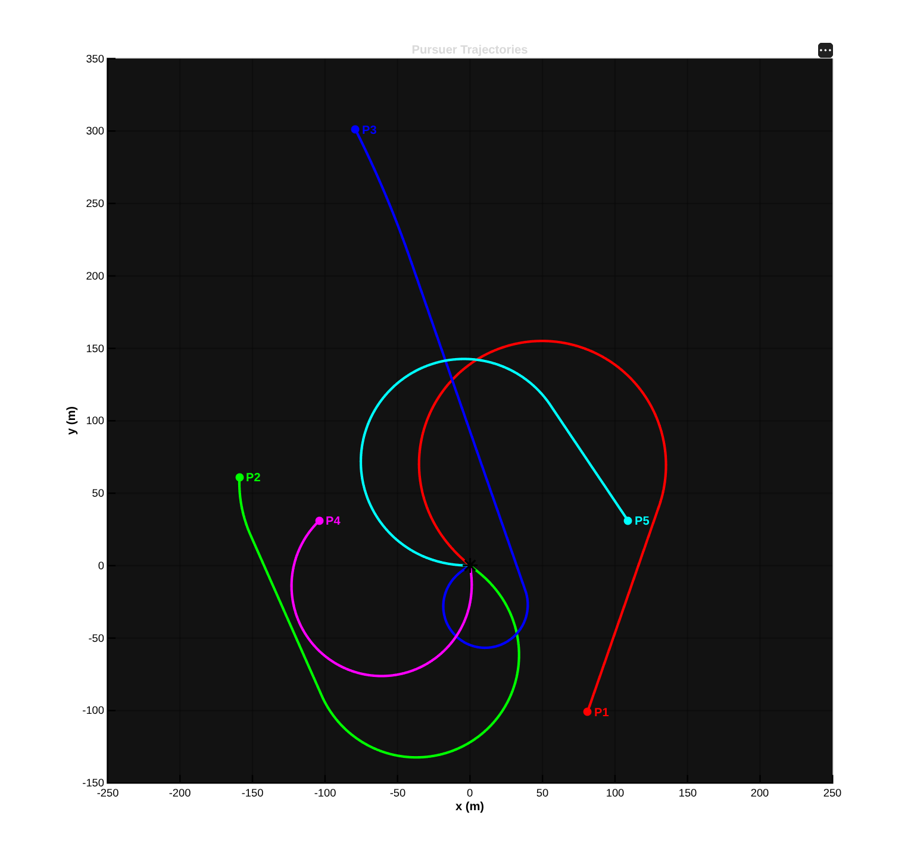
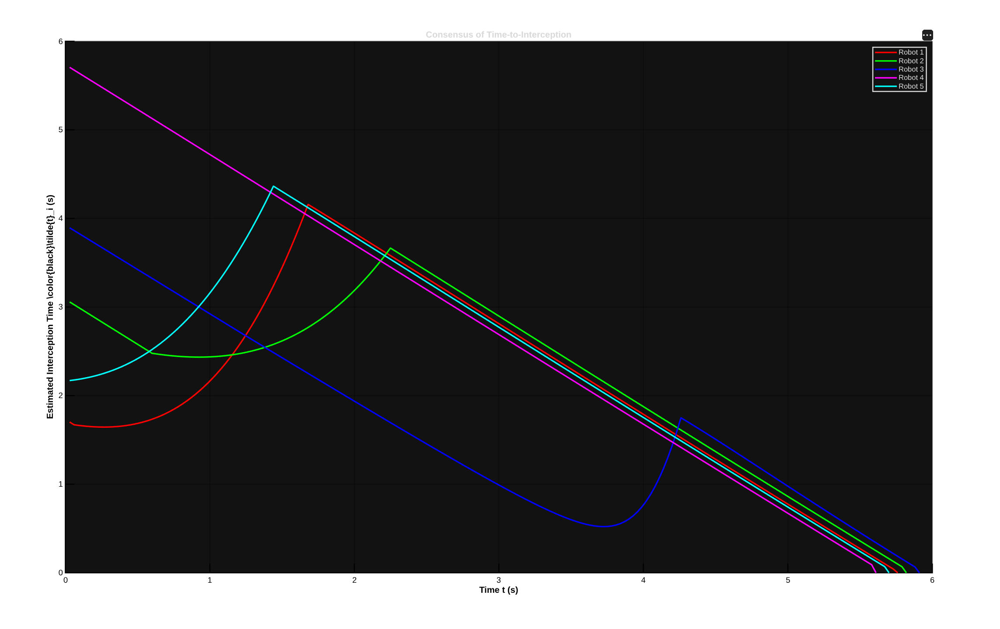

# simultaneous-target-interception
**Simultaneous Target Interception** is the implementation of the research paper    , which proposes a distributed guidance law for the simultaneous interception of a stationary target. The proposed guidance
law establishes the necessary conditions on static graphs as well as on switching graph topologies which ensures simultaneous target interception, regardless of the initial conditions of the pursuers. The proposed guidance formulation is extremely lightweight and efficient, making it suitable for real-time use even on low-cost, resource-constrained onboard computers and in the practical scenarios, where factors such as limited sensory ranges, device failures and the presence of obstacles can
adversely hinder the communication between the pursuers, which leads to switching graphs.

## Implementation Results

### Case 1: In Static Graph

  <!--  -->
  
  
   

  <!--  -->
  <!--  -->

### Case 2: In Switching Graph(without sink)

  <!--  -->
  
  
   

### Case 3: In Switching Graph(with sink)

  <!--  -->
  
  
   

  <!--  -->
  <!--  -->

### Case 3: In Switching Graph(with addition of a new robot in between)

  <!--  -->
  
  
   

<!-- Complete videos: 
[video1](https://www.youtube.com/watch?v=NvR8Lq2pmPg&feature=emb_logo),
[video2](https://www.youtube.com/watch?v=YcEaFTjs-a0), 
[video3](https://www.youtube.com/watch?v=toGhoGYyoAY). 
Demonstrations about this work have been reported on the IEEE Spectrum: [page1](https://spectrum.ieee.org/automaton/robotics/robotics-hardware/video-friday-nasa-lemur-robot), [page2](https://spectrum.ieee.org/automaton/robotics/robotics-hardware/video-friday-india-space-humanoid-robot),
[page3](https://spectrum.ieee.org/automaton/robotics/robotics-hardware/video-friday-soft-exoskeleton-glove-extra-thumb) (search for _HKUST_ in the pages).

-->

To run this project in minutes, check [Quick Start](#1-Quick-Start). Check other sections for more detailed information.

Please kindly star :star: this project if it helps you. We take great efforts to develope and maintain it :grin::grin:.

